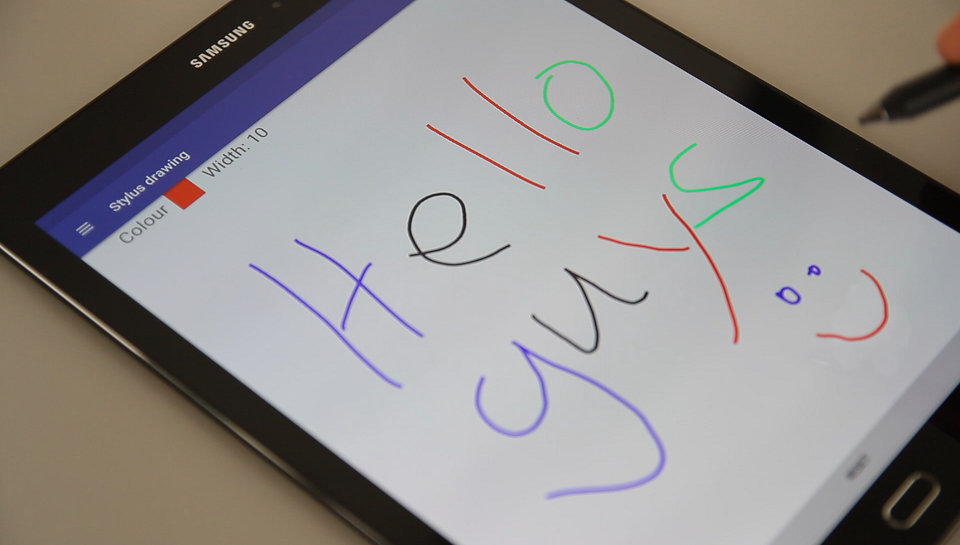

# TouchSense
Repository containing the code for the ISWC paper: "TouchSense: Classifying Finger Touches and Measuring their Force with an Electromyography Armband"

Contact by [email](mailto:vincent.becker@inf.ethz.ch).

The goal of this project is to classify finger touches and estimate their force only by using an EMG armband. We wanted the method to be wireless, 
inexpensive, and to run in real time. Our method classifies touches with the thumb, the forefinger, and the middle finger. The EMG data is gathered with a [Thalmic Labs Myo](https://www.myo.com/). 
We classify the finger used with a neural network designed for EMG data processing which we trained in Tensorflow. The network runs in inference mode on an Android smartphone (10 ms inference execution time per window on an LG Nexus 5X). 
The strength estimation follows a simpler approach and also runs on the Android smartphone. 

We built a hardware setup consisting of three force-sensitive resistors in order to measure the actual pressure applied by the fingers during data collection. This way it is possible to evaluate the quality of our force estimation and also to train personalized force regressors.  

### Possible applications
We built four applications which use our method to make surfaces interactive in order to add functionality. 
1. Using any surface to control a smart lamp. The user can press with his / her forefinger and middle finger to increase or decrease the brightness, respectively.  

2. Adding functionality to a text marking application. The space around can be used as a virtual color palette where the color and width of the strokes can be changed and also strokes may be reverted.  

3. We extend the functionality of a tablet stylus by allowing the user to change the writing color by pressing against the stylus with the thumb.  

4. A bicycle map application which lets the user change the map type and zoom in and out without letting go of the handlebar.  

## Gathering your own data
Coming soon.

## Getting the dataset and preprocessing
* If you want our dataset please send us an email at...
* Once obtained, unpack the data folder. The suggested location is data_preprocessing, i.e. the folder data_preprocessing/data should exist.
* This is the raw data as we obtained from our setup. If you want to use it with our architecture you have to preprocess it. 
  * Use the lstm_data_generation.m MATLAB script for this purpose.
  * Once you run the script, select the "data" folder in the popup. In the next window you can choose which participants to include in the generated samples. By default you will generate the data including every participant.
  * When finished, the files 'lstm_data_users.mat' and 'lstm_data_users_nofore.mat' are generated in the data_preprocessing folder, and contain the preprocessed samples.

## Running the experiments.
* Put the .mat files you generated in the previous step inside the experiments folder. Here you can run the mixed, user-independent and session independent experiments which are shown in the paper. If you want to run an experiments for two finder only (i.e. without forefinger), you have to edit the 'all_fingers' flag in the experiments' script to False.
* usage: for the participant- and session- independent experiments you have to specify the participant's ID to use. For example, to run the session-independent experiment on participant 1 you would write 'python experiment_session_indep.py p1'.
* Results are logged in the console and the confusion matrices are saved automatically to a folder. You can disable this feature by changing the specific flag to False.

## Training a model
* If you want to train your own model you have two options. 
  * To train the model on the whole data, you can run experiment_mixed.py with the test flag set to False.
  * To train on a single user, you can run experiment_session_indep.py for a specific participant with the test flag set to false.
* The model is saved in the experiments folder.

### Freezing a model
* Once the model is trained we have to freeze its weights to produce a .pb file.
* Obtain a copy of the graph freezing script and put it in the experiments folder, along with the produced model files.
* Run the script with the following command:
python freeze_graph.py
--input_graph=graph_name_here.pb \
--input_checkpoint=checkpoint_name_here.ckpt \
--output_graph=/tmp/frozen_model.pb --output_node_names=softmax

## Running the Android application
* Before installing the application on a smartphone you have to put the model file obtained in the previous step in the Android application folder. The frozen model should be located at demo_applications/FingerForce_LSTM/app/src/main/assets/frozen_model.pb. 
* Every time the model is changed, the app has to be uninstalled and reinstalled with the new file in place.
