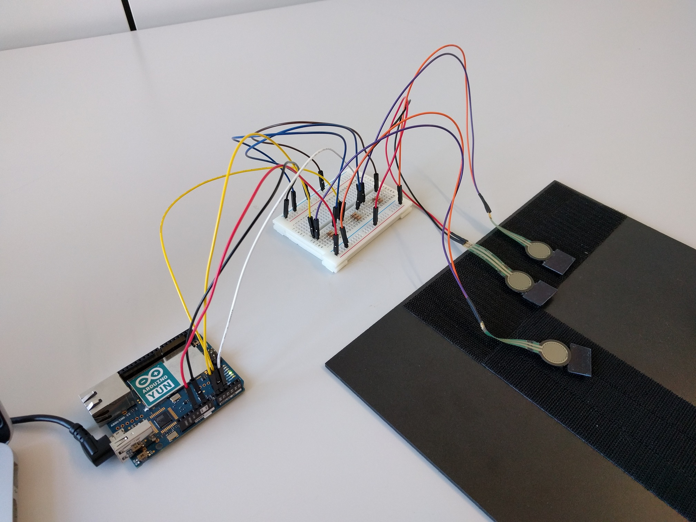

# TouchSense
Repository containing the code for the ISWC paper: "TouchSense: Classifying Finger Touches and Measuring their Force with an Electromyography Armband"

The goal of this project is to classify finger touches and estimate their force only by using an EMG armband. We wanted the method to be wireless, 
inexpensive, and to run in real time. Our method classifies touches with the thumb, the forefinger, and the middle finger. The EMG data is gathered with a [Thalmic Labs Myo](www.myo.com). 
We classify the finger used with a neural network designed for EMG data processing which we trained in Tensorflow. The network runs in inference mode on an Android smartphone (10 ms inference execution time per window on an LG Nexus 5X). 
The strength estimation follows a simpler approach and also runs on the Android smartphone. 

We built a hardware setup consisting of three force-sensitive resistors in order to measure the actual pressure applied by the fingers during data collection. This way it is possible to evaluate the quality of our force estimation and also to train personalized force regressors. 

For details on the method please find the full paper [here](https://people.inf.ethz.ch/vbecker/). TODO A video describing our approach can be found here. TODO

### Possible applications
We built four applications which use our method to make surfaces interactive in order to add functionality. 
1. Using any surface to control a smart lamp. The user can press with his / her forefinger and middle finger to increase or decrease the brightness, respectively 
2. Adding functionality to a text marking application. The space around can be used as a virtual color palette where the color and width of the strokes can be changed and also strokes may be reverted 
3. We extend the functionality of a tablet stylus by allowing the user to change the writing color by pressing against the stylus with the thumb 
4. A bicycle map application which lets the user change the map type and zoom in and out without letting go of the handlebar 

We encourage anyone to use our code to build new applications. Please let us know if you are working on an interesting project. 

In the following we briefly describe the necessary steps to execute the full project pipeline from data collection to running the inference on a smartphone. 
## Dataset
We collected a dataset from 18 participants. For access to the dataset please send us an [email](mailto:vincent.becker@inf.ethz.ch).

## Gathering the data
*Requirements*:
- The hardware setup as in the paper (the paper supplement contains a circuit diagram)
- An Arduino Yún
- The script in the *Arduino* folder
- A Myo armband

Time synchronisation etc. TODO

## Data preparation
*Requirements*:
- A [Matlab](www.mathworks.com/products/matlab.html) installation
- The files csv files containg the EMG and FSR values. 
TODO

## Training the network
*Requirements*:
- A [Tensorflow](https://www.tensorflow.org/) installation
- The mat-file resulting form the previous step
TODO

## Network inference in Android
*Requirements*:
- An [AndroidStudio](https://developer.android.com/studio/) installation
- A Myo armband
- An Android smartphone
Android code is built on top of ... found here. 
TODO